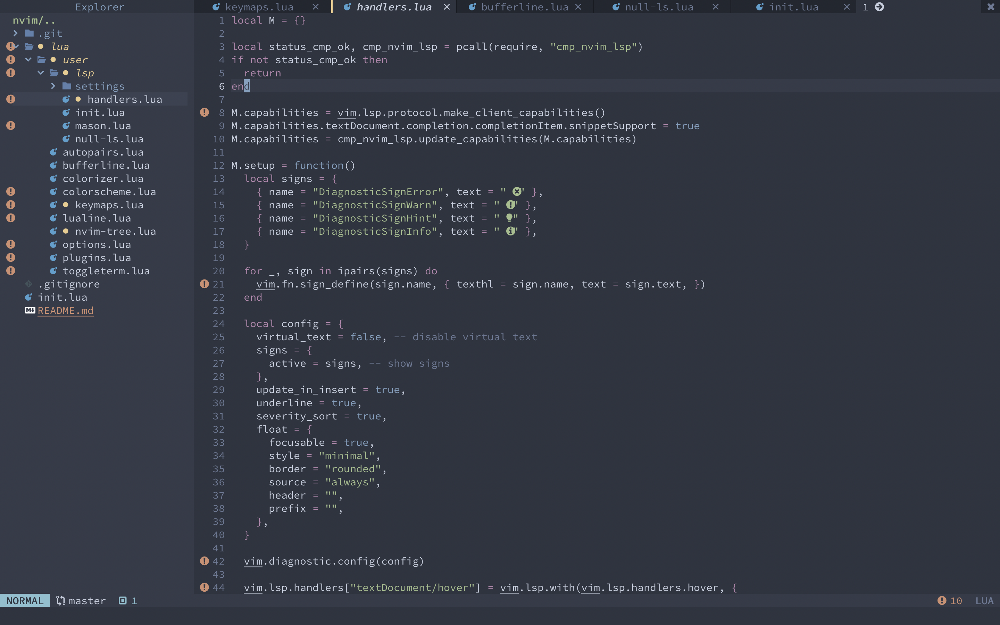

# nvim-dh
Nvim config for Colemak-DH Users.

Built on the basis of [Neovim-froom-Scratch](https://github.com/LunarVim/Neovim-from-scratch)



### Normal/Visual Mode Navigation Keys

```k, e, n, i```: Left, Up, Down, Right

